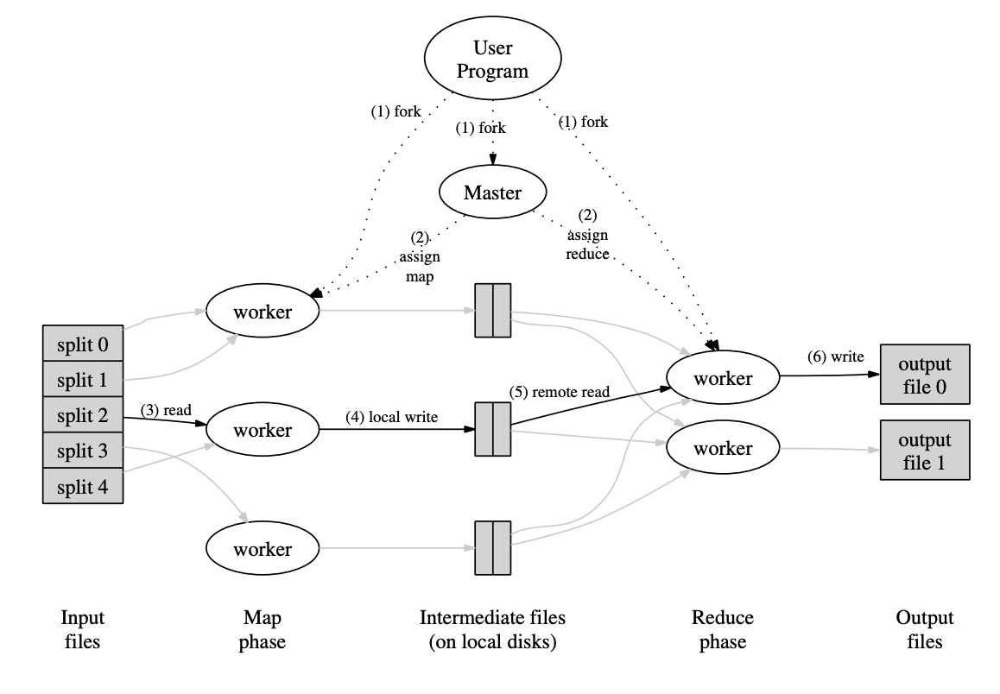

# MapReduce Single Machine


## Introduction



This project is a basic implementation of the MapReduce algorithm, as described in various research papers. Unlike
traditional MapReduce frameworks, this implementation runs on a single machine, without a master node to coordinate the
execution of tasks.

### Features

- **Single Machine Execution**: Designed to run on a single machine, making it easier to test and understand the basic
  concepts of MapReduce.
- **Basic Algorithm Implementation**: Focuses on the fundamental MapReduce operations—mapping and reducing—without
  incorporating advanced features.

### Limitations

- **No Fault Tolerance**: This implementation does not include any fault tolerance mechanisms. If a task fails, it will
  not be retried automatically.
- **No Efficiency Enhancements**: The implementation lacks optimizations that are commonly found in production-grade
  MapReduce systems, such as data locality optimization or resource scheduling.

### Usage

```shell
mvn package
java -jar target/MapReduce-1.0-jar-with-dependencies.jar
```

### References

For more information on the original MapReduce algorithm, you can read
the [MapReduce Paper](https://pdos.csail.mit.edu/6.824/papers/mapreduce.pdf)